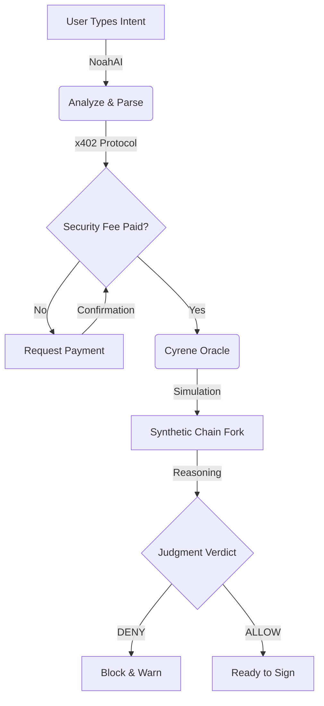

# 🛡️ OBS: Oracle Before Signing - Project Guide

Welcome to the **OBS (Oracle Before Signing)** project! This guide is designed to give you a high-level, visual, and easy-to-understand overview of how the system protects your blockchain transactions.

---

## 🌟 The Core Concept: "See Before You Sign"

Most blockchain exploits happen because users sign transactions without understanding the consequences. **OBS** acts as a security firewall that simulates the "future" of your transaction on a private fork before you ever touch your real wallet.

### 🔄 Transaction Security Flow

---

## 🛠️ Key Features Explained

### 📊 Reality Delta
The system calculates exactly what will happen to your assets. Instead of reading complex hex data, you see:
- **Balance Before**: Your current simulated funds.
- **Balance After**: What will remain after the transaction.
- **Delta**: The net change (e.g., `-100 USDT`).

### ⏳ Future Timeline
We don't just look at the next block; we simulate multiple blocks ahead to detect "Time-Delayed Drains."
- **T+0s**: Your initial signature.
- **T+12s**: Potential secondary malicious calls detected.
- **T+15s**: Final outcome verification.

### 🧠 Adversarial Judgment
The system is designed to be **pessimistic**. It assumes transactions are malicious until proven otherwise. It will ask:
> *"Simulation shows your funds reach 0 after this approval. Why is this acceptable?"*

---

## 💰 The x402 Protocol

Your project uses the **x402 (Pay-per-Verdict)** protocol. 
> [!IMPORTANT]
> **Why pay for a simulation?** 
> High-fidelity security analysis requires running a private blockchain fork. The x402 protocol ensures that the security oracle has the resources to run these complex simulations while preventing spam.

---

## 📁 Project Architecture

- **`apps/frontend`**: The premium Next.js dashboard where you interact with the AI Oracle.
- **`apps/backend`**: The brains of the operation, handling x402 verification and simulation logic.
- **`chain`**: The local Hardhat development environment where the "Synthetic Fork" lives.

---

## 🚀 Troubleshooting Meta-Mask (Account 1 to Account 1)

If you see a transfer from **Account 1 to Account 1** in MetaMask (a self-transfer), it means your project's Recipient Address is set to your own wallet.

**To fix this:**
1.  Open your `.env` file in the root directory.
2.  Update `X402_PAY_TO` to your **Account 2** address.
3.  **Pro Tip**: Ensure you have an `.env` file inside `apps/frontend/` with these same values so the dashboard can read them!

---

**Built for Monad Testnet | Powered by NoahAI**
